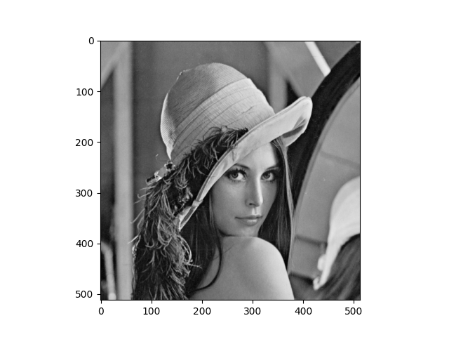

# imageprocessing

Repository to learn fundamental image processing operations like convolution, etc.

## Image Processing Operations

### 2D Convolution
1. Smoothening
2. Sharpening
3. Edge Detection

Smoothening Operation Example:  
     

## installation

Please run install.sh as follows to complete installation:  
$ ./install.sh
